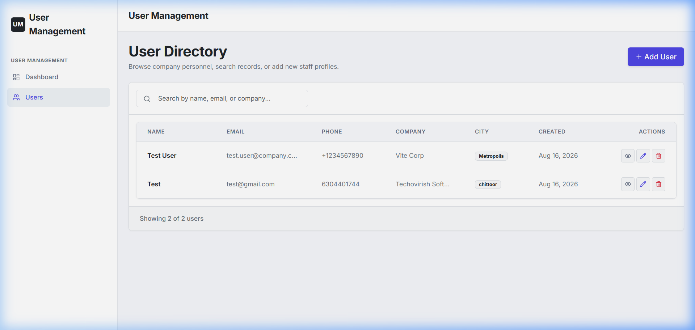
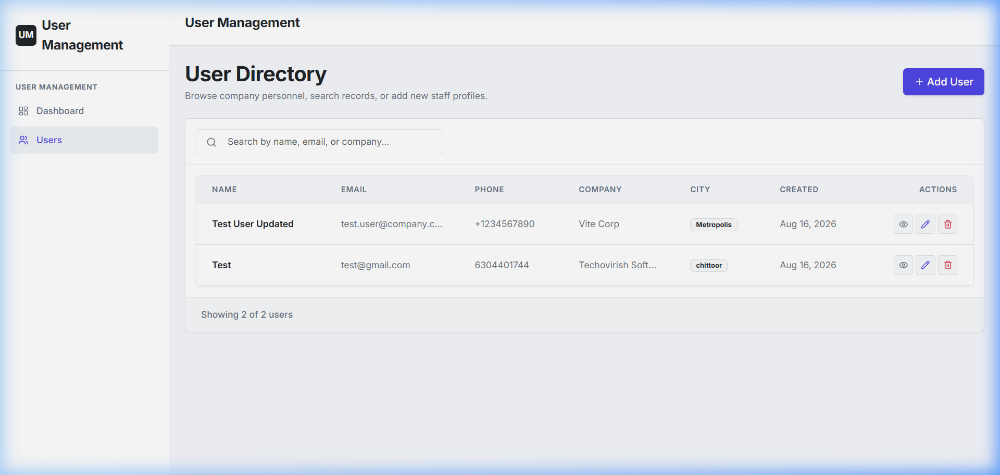
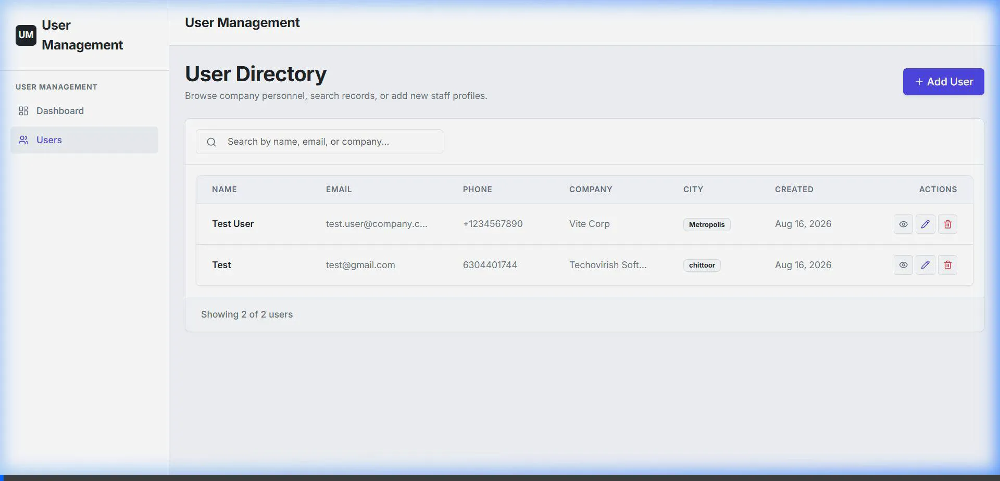

# User Management Dashboard

A modern, full-stack User Management Dashboard. Users can be created, updated, and deleted inside side-drawer overlays (offcanvas forms) directly from the directory list, with real-time statistics updates and fully responsive layout configurations.

# Tech Stack

# Frontend
- Core: React 19, Redux Toolkit (State Management), React Router 7 (Routing)
- Styling: Bootstrap 5.3 with custom vanilla CSS theme variable overrides (`index.css`)
- Icons: Lucide React
- HTTP Client: Axios

# Backend
- Core: Node.js, Express
- Database: MongoDB with Mongoose ODM
- Request Logger: Morgan
- CORS Handling: Dynamic whitelisting middleware

---

# Visual Previews

# 1. Dashboard View
Displays total registered profiles, unique corporate domains, and new weekly registrations, alongside a searchable list of users.


# 2. Add New User (Side Drawer)
Users are added inside a slide-out offcanvas drawer with built-in client-side validation.


# 3. User Details View (Modal Overlay)
Quick detailed profile view including address details, company, and coordinates in a clean overlay format.


# 4. Edit Profile & Validation (Side Drawer)
Live modifications of user records are performed directly in the side drawer. Any field-level database or client validation errors are captured and displayed gracefully.


---

# API Endpoints

# User Directory Routes (`/api/v1/users`)

| Method | Endpoint | Description |
| GET | `/getUsers` | Fetch paginated users list with optional search query |
| GET | `/getUserStats` | Fetch user count, new users count, and unique company count |
| GET | `/getUserById/:id` | Fetch detailed profile data for a single user |
| POST | `/createUser` | Register a new user |
| PUT | `/updateUser/:id` | Update an existing user profile |
| DELETE | `/deleteUser/:id` | Delete a user profile permanently |


# Setup & Running Instructions

# Prerequisites
- [Node.js](https://nodejs.org/) (v18 or higher recommended)
- [MongoDB](https://www.mongodb.com/) (running instance local or cloud URI)

# 1. Backend Server Setup
1. Open a terminal and navigate to the `backend` folder:
   ```bash
   cd backend
   ```
2. Install dependencies:
   ```bash
   npm install
   ```
3. Create a `.env` file in the `backend` root directory and add the following configuration:
   ```env
   PORT=5000
   MONGODB_URI=mongodb://localhost:27017/userhub
   CLIENT_URL=http://localhost:5173
   ```
4. Start the backend server in development mode:
   ```bash
   npm run dev
   ```
   The backend service runs at `http://localhost:5000`.

# 2. Frontend Client Setup
1. Open a new terminal and navigate to the `frontend` folder:
   ```bash
   cd frontend4
   ```
2. Install dependencies:
   ```bash
   npm install
   ```
3. Start the Vite development server:
   ```bash
   npm run dev
   ```
   The frontend application is accessible at `http://localhost:5173`.
